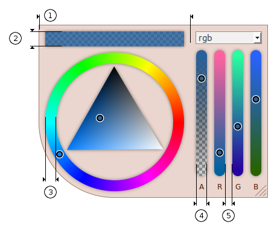

# Documentation
- [Index](../README.md)
  - [Demos](../README.md#demos)
  - [Features](../README.md#features)
  - [Requirements](../README.md#requirements)
  - [Install](../README.md#install)
  - [Build](../README.md#build)
- [Screenshots](screenshots.md#screenshots)
- [Gettings started](getting-started.md#getting-started)
- API
  - [Properties](properties.md#properties)
  - [Events](events.md#events)
  - [Methods](methods.md#methods)
  - [Api Object](api-object.md#api-object)
  - [Overriding defaults](defaults.md#overriding-defaults)
  - [Color manipulation](color.md#color-manipulation)
- [Dimensions](dimensions.md#dimensions)
- [Theming](theming.md#theming)

# Dimensions

  1. Width of the color picker. Set with the [width](properties.md#width) API property.
  2. Height of the preview box. Set in the CSS file.
  3. Width of the hue selector. Set with [ringwidth](properties.md#ringwidth) API property.
  4. Width of a channel in the panel. Set with [panelChannelWidth](properties.md#panelchannelwidth) API property.
  5. Margin around a channel in the panel. Set with [panelChannelMargin](properties.md#panelchannelmargin) API property.

Also, many other dimensions can be changed in the CSS file.