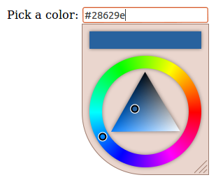
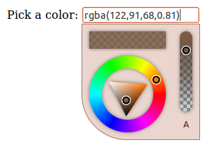
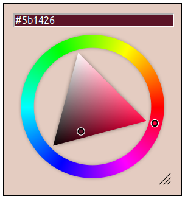
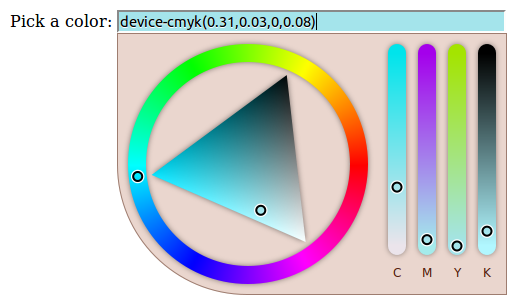
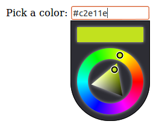
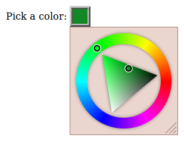
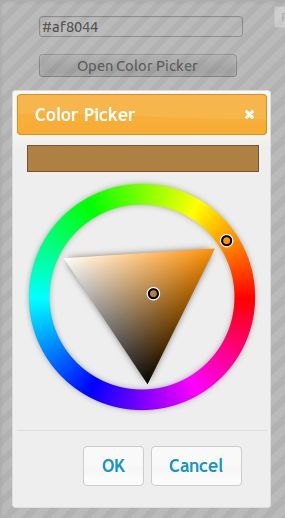

# Documentation
- [Index](../README.md)
  - [Demos](../README.md#demos)
  - [Features](../README.md#features)
  - [Requirements](../README.md#requirements)
  - [Install](../README.md#install)
  - [Build](../README.md#build)
- [Screenshots](screenshots.md)
- [Gettings started](gettings-started.md)
- API
  - [Properties](properties.md)
  - [Events](events.md)
  - [Methods](methods.md)
  - [Api Object](api-object.md)
  - [Overriding defaults](defaults.md)
  - [Color manipulation](color.md)
- [Dimensions](dimensions.md)
- [Theming](theming.md)

# Screenshots
## Screenshot 1
- All default options

## Screenshot 2
- Output: RGBA string
- Alpha selection: true
- Resizable: false
- Width: 130px

## Screenshot 3
- Static mode
- Color preview in input element

## Screenshot 4
- Output: HSLA string
- Alpha selection: true
- Side panel: true

## Screenshot 5
- Preview in INPUT element
- Width: 260px
- Resizable: false
- Side panel: true
- Side panel mode: CMYK only

## Screenshot 6
- Dark theme
- Resizable: false
- Width: 130px

## Screenshot 7
- Preview in INPUT element
- Custom INPUT element styling
- Square corners

## Screenshot 8
- Sample integration with jQuery-mobile dialog.

## Screenshot 9
- Sample integration with jQuery UI dialog.

